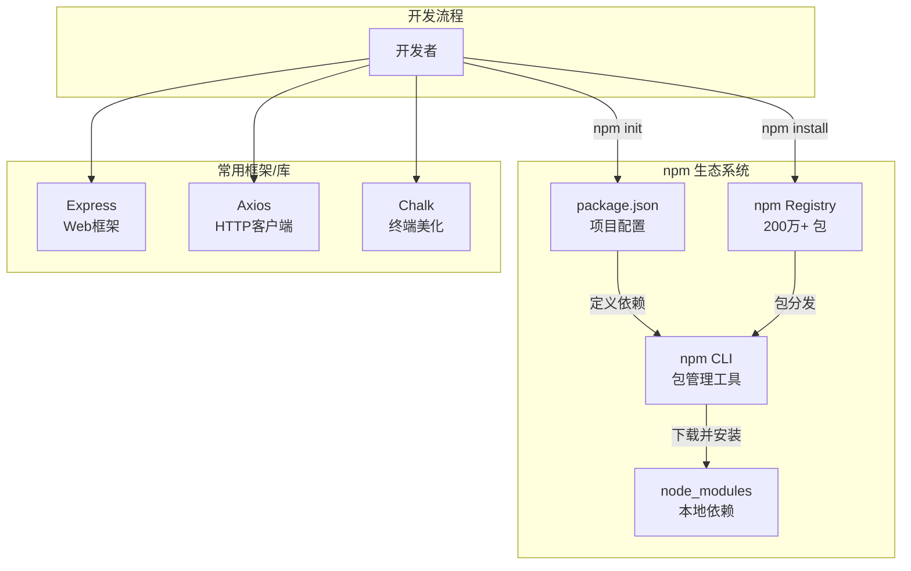
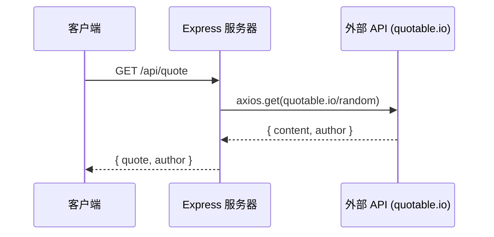
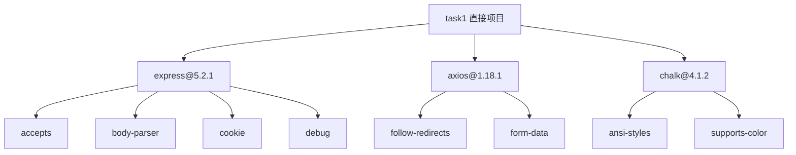

# 任务一：Node.js & npm 开发者生态探索

> **课程**: OSSD 开源软件开发  
> **实验**: Lab 1 - 开发者生态工具探索  
> **学号**: 25307023  
> **日期**: 2026-07-02

---

## 📋 目录

1. [任务描述](#任务描述)
2. [开发者生态系统概述](#开发者生态系统概述)
3. [环境准备](#环境准备)
4. [项目初始化](#项目初始化)
5. [npm 包管理器探索](#npm-包管理器探索)
6. [Express Web 框架实践](#express-web-框架实践)
7. [Axios HTTP 客户端使用](#axios-http-客户端使用)
8. [Chalk 终端美化工具](#chalk-终端美化工具)
9. [完整 CLI 工具演示](#完整-cli-工具演示)
10. [生态系统依赖分析](#生态系统依赖分析)
11. [总结与心得](#总结与心得)

---

## 任务描述

本任务旨在深入探索 **Node.js & npm 开发者生态系统**，通过实践操作理解包管理、模块化开发和第三方库集成的核心概念。Node.js 生态系统是全球最大的开源软件生态之一，npm 注册表中拥有超过 **200 万个包**，是现代 Web 开发的重要基础设施。

### 任务目标

- ✅ 搭建 Node.js 开发环境
- ✅ 使用 npm 初始化项目并管理依赖
- ✅ 深入理解 `package.json` 和 `node_modules` 机制
- ✅ 使用 Express 框架搭建 REST API 服务
- ✅ 使用 Axios 进行 HTTP 请求
- ✅ 使用 Chalk 美化终端输出
- ✅ 分析依赖树和生态系统规模

---

## 开发者生态系统概述

Node.js 的开发者生态系统是全球最大的软件开发生态之一。以下是 npm 生态系统的基本架构：



---

## 环境准备

### Node.js 与 npm 版本

```bash
$ node --version
v26.4.0

$ npm --version
11.17.0
```

> **说明**: Node.js v26.4.0 是当前最新的 LTS 长期支持版本，npm 是其内置的包管理器。

### 项目目录结构

```
task1/
├── package.json          # 项目配置与依赖声明
├── package-lock.json     # 依赖锁定文件（精确版本）
├── node_modules/         # 本地依赖目录
├── index.js              # Express 服务主文件
└── cli-tool.js           # CLI 演示工具
```

---

## 项目初始化

### 使用 npm init 创建项目

```bash
$ cd task1
$ npm init -y
```

执行后生成 `package.json` 文件：

```json
{
  "name": "task1",
  "version": "1.0.0",
  "description": "",
  "main": "index.js",
  "scripts": {
    "test": "echo \"Error: no test specified\" && exit 1"
  },
  "keywords": [],
  "author": "",
  "license": "ISC",
  "type": "commonjs"
}
```

> **关键字段说明**:
> - `name`: 包名称，在 npm 注册表中唯一标识
> - `version`: 语义化版本号 (SemVer)
> - `main`: 包的入口文件
> - `scripts`: 自定义脚本命令
> - `dependencies`: 生产环境依赖（安装后自动添加）

---

## npm 包管理器探索

### 安装依赖包

```bash
$ npm install express axios chalk@4.1.2
```

执行结果：
```
added 82 packages, and audited 83 packages in 3s
28 packages are looking for funding
found 0 vulnerabilities
```

### 依赖安装后的 package.json

```json
{
  "name": "task1",
  "version": "1.0.0",
  "dependencies": {
    "axios": "^1.18.1",
    "chalk": "^4.1.2",
    "express": "^5.2.1"
  }
}
```

> **语义化版本说明**: `^1.18.1` 表示兼容 1.x.x 的最新版本。

### 查看已安装的依赖树

```bash
$ npm list --depth=0
task1@1.0.0
├── axios@1.18.1
├── chalk@4.1.2
└── express@5.2.1
```

### npm 常用命令

| 命令 | 说明 |
|------|------|
| `npm install <pkg>` | 安装包并添加到 dependencies |
| `npm install -D <pkg>` | 安装包并添加到 devDependencies |
| `npm uninstall <pkg>` | 卸载包 |
| `npm update` | 更新所有依赖 |
| `npm outdated` | 查看过时的依赖 |
| `npm audit` | 安全审计 |
| `npm list` | 列出依赖树 |

---

## Express Web 框架实践

### 代码实现 (`index.js`)

创建了一个功能完整的 REST API 服务器，包含以下端点：

| 端点 | 方法 | 功能 |
|------|------|------|
| `/` | GET | 项目信息和 API 导航 |
| `/health` | GET | 健康检查 |
| `/api/quote` | GET | 获取随机名言（调用外部 API） |
| `/api/deps` | GET | 查看已安装的依赖 |

### API 请求流程



---

## Axios HTTP 客户端使用

Axios 是一个基于 Promise 的 HTTP 客户端，支持浏览器和 Node.js。

### 核心特性

- ✅ 自动 JSON 数据转换
- ✅ 请求/响应拦截器
- ✅ 取消请求
- ✅ 超时处理
- ✅ 并发请求

### 在 CLI 工具中的使用

```javascript
const response = await axios.get('https://httpbin.org/get', {
  params: { hello: 'world' }
});
console.log(`状态码: ${response.status}`);       // 200
console.log(`请求URL: ${response.data.url}`);    // https://httpbin.org/get?hello=world
```

---

## Chalk 终端美化工具

Chalk 是一个流行的终端字符串样式库，提供简洁的 API 来为终端输出添加颜色和样式。

### 使用示例

```javascript
const chalk = require('chalk');

// 基础颜色
console.log(chalk.green('成功信息'));
console.log(chalk.red('错误信息'));
console.log(chalk.yellow('警告信息'));

// 组合样式
console.log(chalk.bold.cyan('粗体青色文字'));
console.log(chalk.bgGreen.black('绿色背景黑色文字'));
```

---

## 完整 CLI 工具演示

运行 `cli-tool.js` 的输出：

```
=== NPM 生态工具演示 CLI ===

📦 Node.js 环境信息:
   版本: v26.4.0
   平台: win32
   架构: x64

📋 项目信息:
   项目名: task1
   版本: 1.0.0

📦 已安装依赖 (3个):
   1. axios ^1.18.1
   2. chalk ^4.1.2
   3. express ^5.2.1

🌐 使用 axios 发起 HTTP 请求...
   状态码: 200
   请求URL: https://httpbin.org/get?hello=world

=== 演示完成 ===
```

---

## 生态系统依赖分析

### 依赖传递图

安装 3 个直接依赖后，npm 自动安装了 82 个包（包括传递依赖）。



> **传递依赖说明**: npm 的依赖管理采用扁平化的 `node_modules` 结构，每个包可以声明自己的依赖，npm 会自动解析和安装整个依赖树。

### npm 生态系统规模

| 指标 | 数据 |
|------|------|
| npm 注册表总包数 | 2,000,000+ |
| 每周下载量 | 数十亿次 |
| 本项目直接依赖 | 3 个 |
| 本项目总安装包数 | 82 个 |
| 传递依赖层数 | 3-5 层 |

---

## 总结与心得

### 学习要点

1. **npm 生态的核心理念**: npm 是世界上最大的软件注册表，通过简单的 `npm install` 命令即可复用数十万个开源包，极大提升了开发效率。

2. **包管理机制**: `package.json` 声明依赖，`package-lock.json` 锁定精确版本，确保团队协作中环境一致性。

3. **模块化开发**: Node.js 的 CommonJS 模块系统 (`require`/`module.exports`) 使得代码组织清晰，功能解耦。

4. **生态互操作性**: Express、Axios、Chalk 等包可以无缝集成在一个项目中，体现了开源生态的协同价值。

### 关键收获

- ✅ 掌握了 npm 依赖管理完整工作流
- ✅ 理解了传递依赖和版本管理机制
- ✅ 实践了 RESTful API 开发
- ✅ 体验了第三方包集成的便捷性

---

> 📎 **相关资源**:
> - [Node.js 官网](https://nodejs.org/)
> - [npm 官方文档](https://docs.npmjs.com/)
> - [Express.js 文档](https://expressjs.com/)
> - [Axios 文档](https://axios-http.com/)
> - [Chalk GitHub](https://github.com/chalk/chalk)
