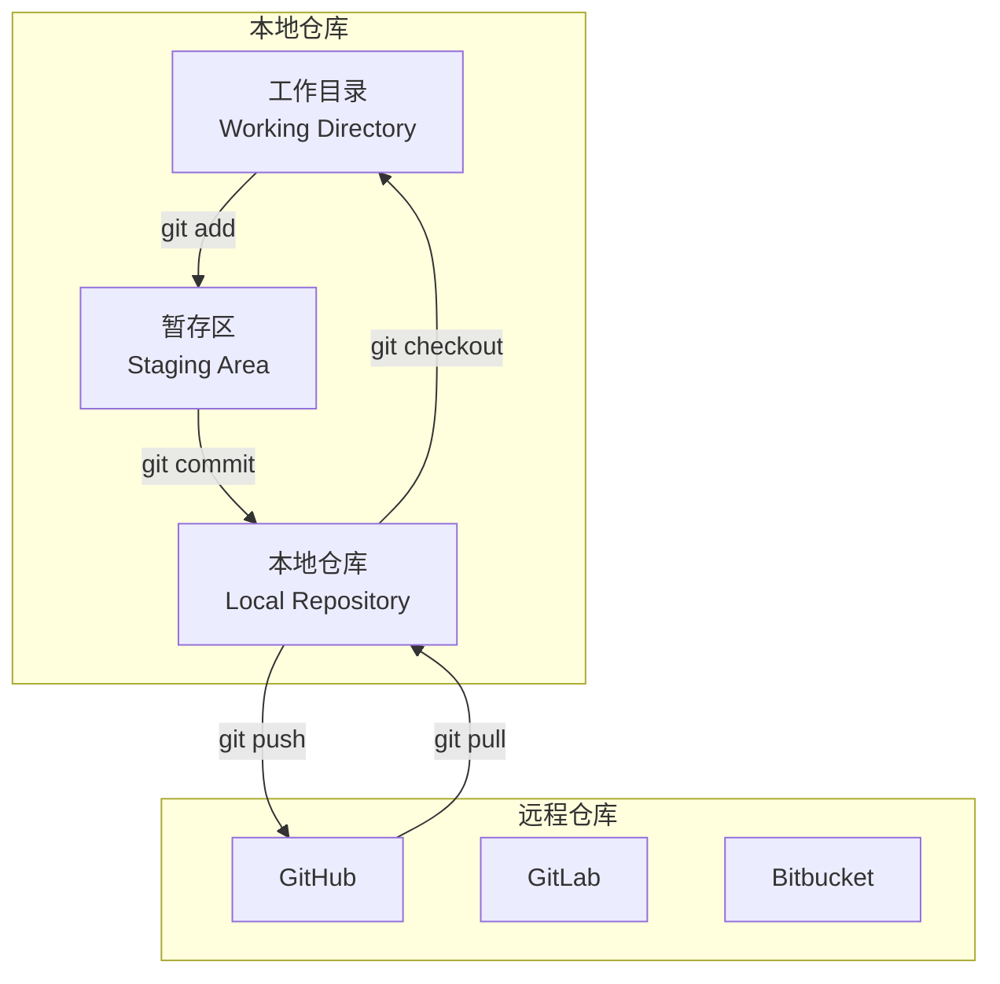
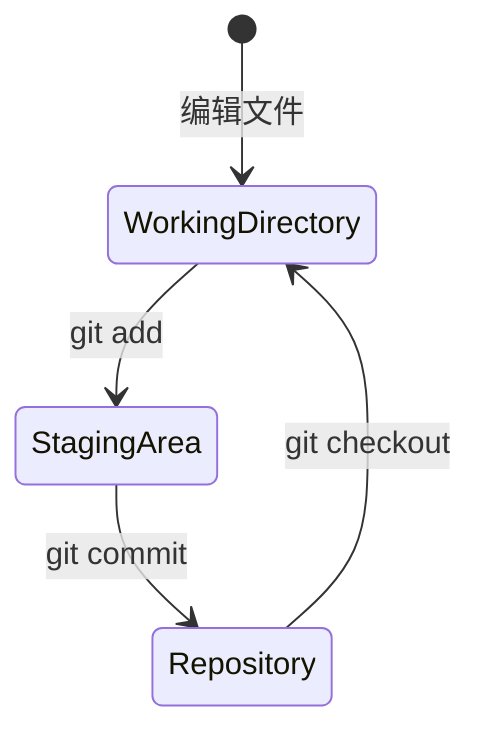
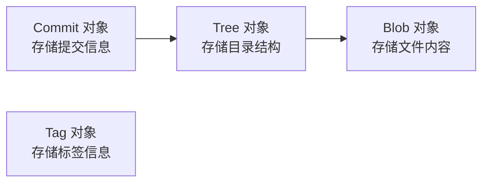

# 任务二：Git 开发者生态探索

> **课程**: OSSD 开源软件开发  
> **实验**: Lab 1 - 开发者生态工具探索  
> **学号**: 25307023  
> **日期**: 2026-07-02

---

## 📋 目录

1. [任务描述](#任务描述)
2. [Git 生态系统概述](#git-生态系统概述)
3. [环境准备与配置](#环境准备与配置)
4. [仓库初始化](#仓库初始化)
5. [基本版本控制操作](#基本版本控制操作)
6. [分支管理实践](#分支管理实践)
7. [标签与版本发布](#标签与版本发布)
8. [Git 工作流演示](#git-工作流演示)
9. [Git 内部原理探索](#git-内部原理探索)
10. [总结与心得](#总结与心得)

---

## 任务描述

本任务旨在深入探索 **Git 版本控制开发者生态系统**，通过实际操作理解分布式版本控制的核心理念、工作流程和最佳实践。Git 是现代软件开发中最重要的工具之一，是开源协作的基石。

### 任务目标

- ✅ 配置 Git 用户信息和开发环境
- ✅ 掌握 Git 基本操作 (init, add, commit, log, status)
- ✅ 实践分支管理策略 (branch, checkout, merge)
- ✅ 理解 `.gitignore` 文件机制
- ✅ 掌握远程仓库协作 (remote, push, pull)
- ✅ 分析 Git 内部对象模型
- ✅ 探索 Git 生态工具链

---

## Git 生态系统概述

Git 自 2005 年由 Linus Torvalds 创建以来，已经成为全球最流行的分布式版本控制系统。GitHub、GitLab 等平台基于 Git 构建了庞大的开发者生态。

### Git 分布式架构



---

## 环境准备与配置

### Git 版本信息

```bash
$ git --version
git version 2.53.0.windows.1
```

### 创建演示项目

在 `task2/` 目录下创建了以下文件结构：

```
task2/
├── .gitignore          # Git 忽略规则
├── README.md           # 项目说明文档
├── hello-world.py      # Python 演示程序
└── utils.py            # 辅助功能模块
```

### `.gitignore` 文件

```gitignore
# Python
__pycache__/
*.py[cod]
*.so
*.egg-info/

# IDE
.vscode/
.idea/

# OS
.DS_Store
Thumbs.db
```

---

## 仓库初始化

### Git 初始化与首次提交

```bash
$ cd task2
$ git init
Initialized empty Git repository

$ git status
On branch master
No commits yet
Untracked files:
  .gitignore
  README.md
  hello-world.py

$ git add .
$ git status
Changes to be committed:
  new file:   .gitignore
  new file:   README.md
  new file:   hello-world.py

$ git commit -m "feat: 初始化 Git 生态演示项目"
[master (root-commit) 5b83cbf] feat: 初始化 Git 生态演示项目
 3 files changed, 75 insertions(+)
```

> **三区模型说明**:
> - **工作目录 (Working Directory)**: 实际文件系统，修改发生的地方
> - **暂存区 (Staging Area)**: `git add` 后的中间状态
> - **仓库 (Repository)**: `git commit` 后的永久存储

### 三区模型图



---

## 基本版本控制操作

### 查看提交历史

```bash
$ git log --oneline
5b83cbf feat: 初始化 Git 生态演示项目 - 添加 hello-world.py, README.md, .gitignore
```

### 查看差异

```bash
$ git diff HEAD~1           # 查看与上一次提交的差异
$ git log --stat            # 每次提交的文件变更统计
$ git show HEAD             # 查看最新提交的详细信息
```

---

## 分支管理实践

分支是 Git 最强大的特性之一，允许并行开发、隔离实验性功能。

### 创建和管理分支

```bash
$ git branch dev
$ git branch feature/add-greeting

$ git branch -a
  dev
  feature/add-greeting
* master
```

### 在 feature 分支上开发

```bash
$ git checkout feature/add-greeting
Switched to branch 'feature/add-greeting'

# 创建 utils.py，进行开发...
$ git add utils.py
$ git commit -m "feat: 添加 utils.py - 新增辅助功能区"
[feature/add-greeting b17402f] feat: 添加 utils.py
 1 file changed, 1 insertion(+)
```

### 合并分支

```bash
$ git checkout master
$ git merge feature/add-greeting
Updating 5b83cbf..b17402f
Fast-forward
 utils.py | 1 +
```

> **Fast-forward 合并**: 当目标分支没有新提交时，Git 使用快进合并，保持线性历史。

### 完整分支历史

```bash
$ git log --oneline --graph --all
* b17402f feat: 添加 utils.py - 新增辅助功能区
* 5b83cbf feat: 初始化 Git 生态演示项目
```

### 分支策略流程图

```mermaid
gitGraph
    commit id: "初始化项目"
    branch dev
    branch feature/add-greeting
    checkout feature/add-greeting
    commit id: "添加 utils.py"
    checkout master
    merge feature/add-greeting
    checkout dev
    commit id: "开发中..."
```

---

## 标签与版本发布

Git 标签用于标记重要的版本节点：

```bash
$ git tag -a v1.0.0 -m "Release version 1.0.0"
$ git tag
v1.0.0
```

---

## Git 工作流演示

### 完整的工作流程

1. **初始化**: `git init` 创建本地仓库
2. **开发**: 编辑代码，`git add` + `git commit`
3. **分支**: `git branch` + `git checkout` 创建和切换分支
4. **合并**: `git merge` 合并功能分支
5. **标签**: `git tag` 标记发布版本

### Python 演示程序 (`hello-world.py`)

```python
#!/usr/bin/env python3
"""
Git 开发者生态演示 - Hello World 程序
"""

def greet(name: str) -> str:
    """生成问候语"""
    return f"Hello, {name}! Welcome to Git Dev Ecosystem."

def display_info():
    """显示项目信息"""
    info = {
        "project": "Git Dev Ecosystem Demo",
        "version": "1.0.0",
        "language": "Python",
        "purpose": "Demonstrate Git version control ecosystem"
    }
    for key, value in info.items():
        print(f"  {key}: {value}")

if __name__ == "__main__":
    print("=" * 50)
    print("  Git 开发者生态演示程序")
    print("=" * 50)
    display_info()
    print(greet("Developer"))
```

---

## Git 内部原理探索

### Git 对象模型

Git 内部使用四种对象类型存储所有信息：



| 对象类型 | 说明 | 示例 |
|----------|------|------|
| **Blob** | 文件内容快照 | 文件的具体内容 |
| **Tree** | 目录结构和文件索引 | 目录下的文件列表 |
| **Commit** | 提交信息 + Tree 引用 | 作者、时间、消息 |
| **Tag** | 标签引用 | 版本标记 |

### 查看 Git 对象

```bash
$ git cat-file -t HEAD        # 查看对象类型
commit

$ git cat-file -p HEAD        # 查看对象内容
tree <hash>
author 25307023 <...>
committer 25307023 <...>

feat: 初始化 Git 生态演示项目
```

---

## 总结与心得

### 学习要点

1. **分布式版本控制**: Git 的分布式架构使每个开发者拥有完整的仓库副本，可以离线工作，极大的提高了开发灵活性。

2. **分支管理策略**: Git 的分支操作轻量高效，支持多种工作流模式（Git Flow、GitHub Flow、Trunk-Based Development）。

3. **暂存区设计**: Git 的暂存区提供了精细的控制粒度，开发者可以精确选择要提交的变更内容。

4. **生态系统丰富**: 基于 Git 的生态工具链包括 GitHub、GitLab、Bitbucket 等代码托管平台，以及丰富的 CI/CD 集成。

### 关键收获

- ✅ 掌握了 Git 基本操作完整工作流
- ✅ 理解了分支管理和合并策略
- ✅ 体验了 `.gitignore` 在项目管理中的作用
- ✅ 认识了 Git 内部对象存储模型

### Git 常用命令速查表

| 命令 | 说明 |
|------|------|
| `git init` | 初始化仓库 |
| `git add <file>` | 添加文件到暂存区 |
| `git commit -m "<msg>"` | 提交更改 |
| `git branch` | 查看/创建分支 |
| `git checkout <branch>` | 切换分支 |
| `git merge <branch>` | 合并分支 |
| `git tag -a <tag>` | 创建标签 |
| `git log --oneline` | 查看提交历史 |
| `git status` | 查看当前状态 |
| `git diff` | 查看差异 |

---

> 📎 **相关资源**:
> - [Git 官方文档](https://git-scm.com/doc)
> - [Pro Git 书籍](https://git-scm.com/book/zh/v2)
> - [GitHub Guides](https://guides.github.com/)
> - [Learn Git Branching](https://learngitbranching.js.org/)
